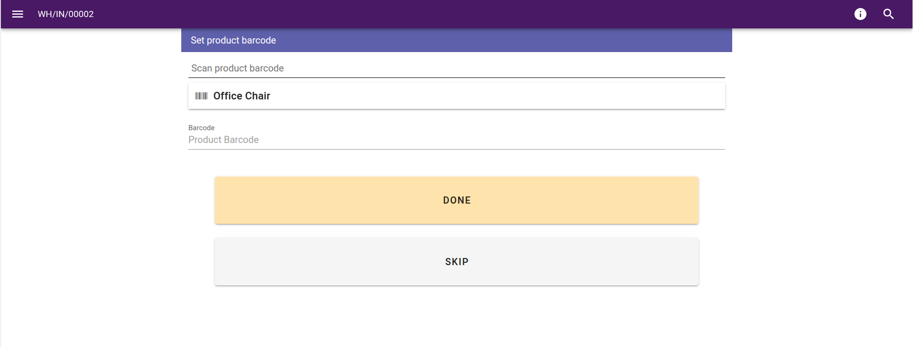

This module adds an option to the reception scenario.
When activated, before setting the quantity for the reception, if there is product received with
missing barcode, the user will be presented with a screen proposing to update the barcode.

The scanned barcode will be parsed and so, EAN will be extracted from GS1 if `shopfloor_gs1`
module is installed.

